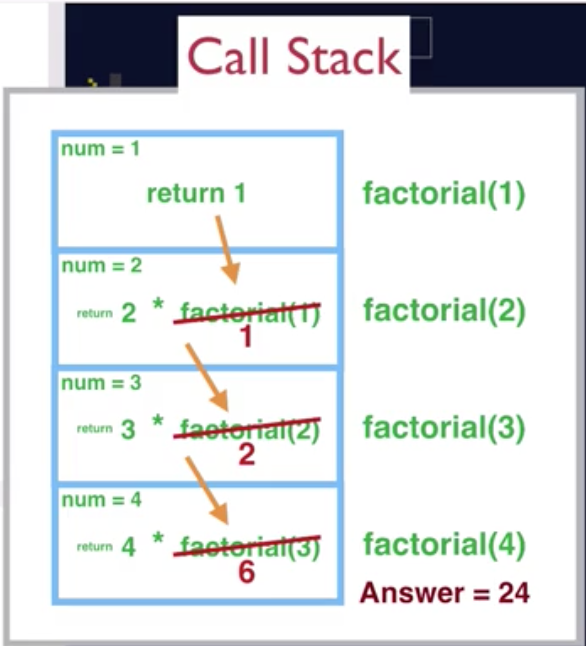

# Recursive functions
## For example
```javascript
function factorial(num) {
  if(num === 1){
    // base case
    return num;
  } else {
    // recursive case
    return num * factorial(num - 1);
  }
}

factorial(4);
```
In a recursive function there is a base case and a recursive case. The base case exits the function after unwinding the call stack. The recursive case calls the function until the base case condition is met and adds each function call to the call stack. When base case is met the call stack is then unwound until the call stack is empty, then the function exits and returns a value.

## The call stack


