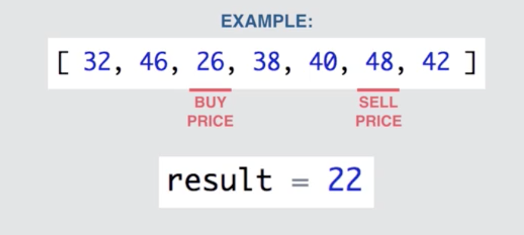

# Max Stock Profit
Takes an array of prices as a parameter and returns the max possible profit for that day.

## Notes
* If no profit is possible, return -1.
* A max profit of 0 is treated as any other max profit value.
* Try to solve in **O(n)** - linear runtime.

