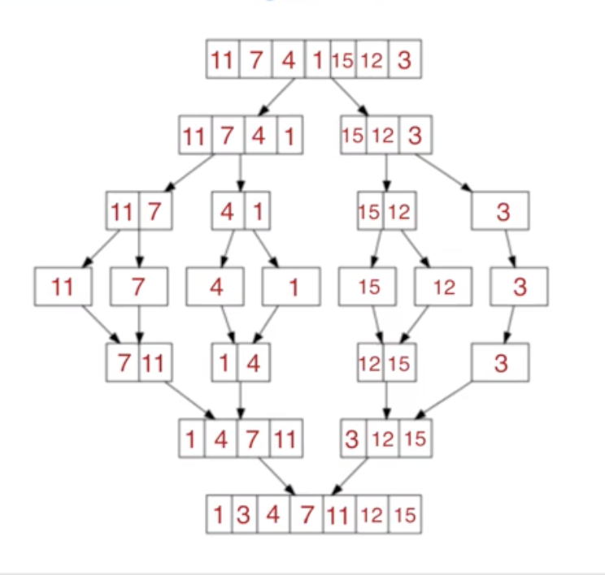
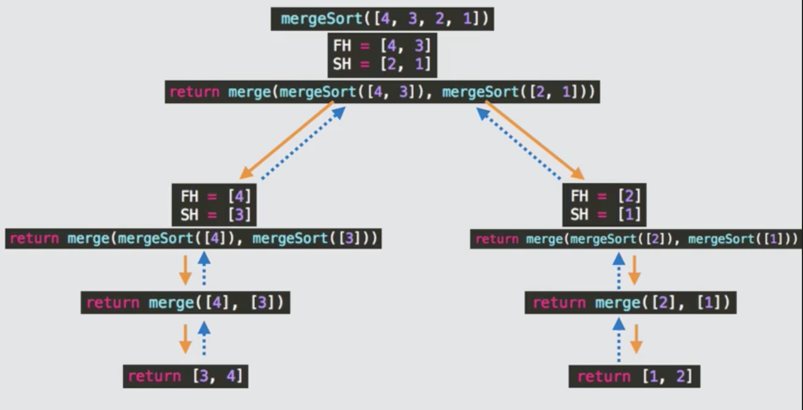
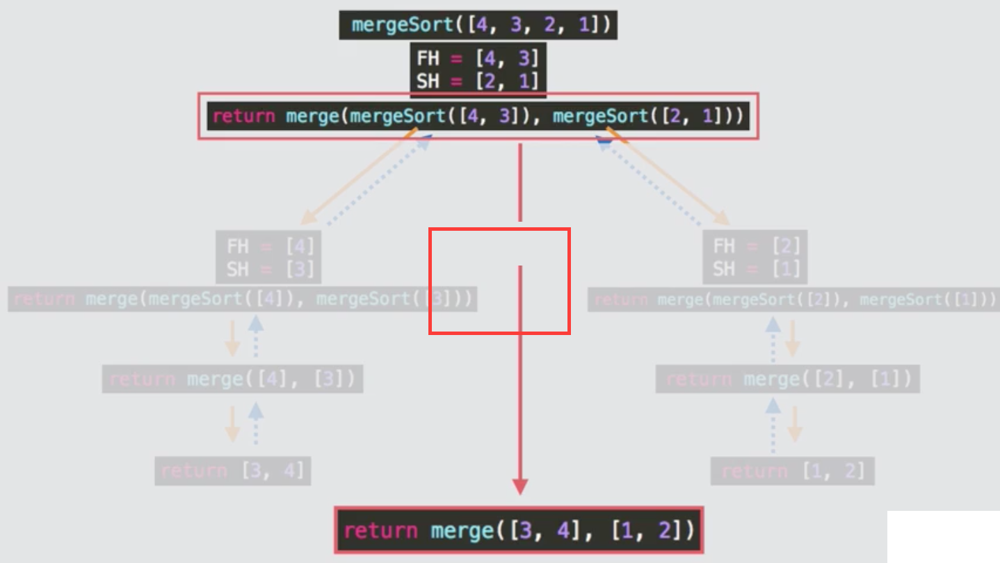
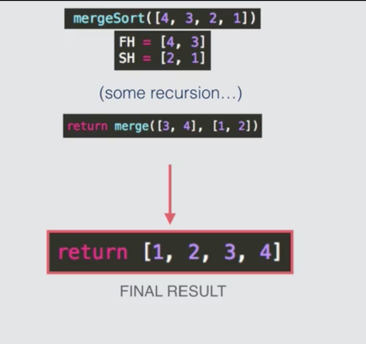

# Merge Sort
Lets say we have the following arrays.

## starting arrays
```
[3,5,8,20]
```
```
[1,2,12,17]
```
We then compare each element in the arrays and then move the least value into the final array. We end up with the following:

## final array
```
[1,2,3,5,8,12,17,20]
```

## How about unsorted arrays?
Here is a visualization using the following unsorted array:

```
[11,7,4,1,15,12,3]
```



## Another example





